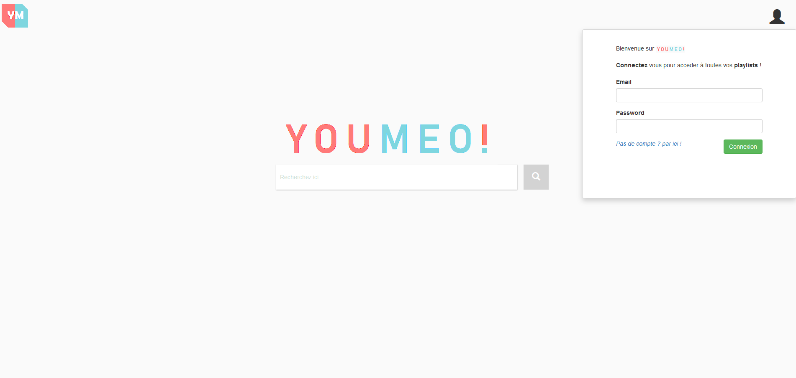

--------
**Youmeo** est une application réalisée dans le cadre du cours *Urbanisation et gouvernance des SI*.

L'équipe qui a réalisé ce projet est composée de **Thibaut Lafon, Hugo Desbiolles et Mélissa L'Hénoret**.

| **Connexion**                          | **Inscription**                          | **Recherche Video**                    | **Historique**                         | 
| :------------------------------------: | :--------------------------------------: | :------------------------------------: | :------------------------------------: | 
| | | ||

|**Video**                           |   **Liste des Playlists**                   | **Playlist**                           | **Mon compte**                      | 
|:---------------------------------: | :-----------------------------------------: | :------------------------------------: | :---------------------------------: | 
| |  |  | |

| **Admin**                          | 
| :--------------------------------: | 
| |

Le projet est composé de 4 silos et un pilote.

Les silos et le pilote sont des applications indépendantes.

Le Front a été développé en [Angular6](https://angular.io/) et le Backend en [NodeJS](https://nodejs.org/en/)

## Prérequis
1. Installer [nodeJS](https://nodejs.org/en/) 11
2. Installer [MongoDB](https://www.mongodb.com/fr) 4

## Installation
Dans un Terminal:
1. Cloner le projet 
```
git clone https://github.com/HugoDesb/youmeo.git
```
2. Installer les dépendances
```bash
cd angular-youmetu
npm install
```
## Exécution
1. Ouvrir un terminal dans le dossier angular-youmetu et lancer la commande : 
```bash
ng serve
```
2. puis ouvrir le navigateur a l'adresse http://localhost:4200/

## Admin
Utiliser le user admin existant lors de la connexion:
* Email: *admin@admin.fr*
* Password: *admin*

## TodoList
L'application **TodoList** est réliée au pilote de notre api Youmeo 


